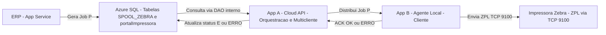
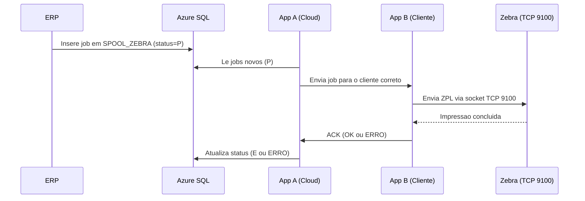

# 📘 Documentação Oficial — Arquitetura de Impressão Zebra (Saveinformatica)

**Versão 1.0 — Formato Markdown (para hospedagem no GitHub Pages)**  
**Data:** 18/02/2026  
**Autor:** André Di Battista 

---

## 1. 🎯 Resumo Executivo

A Saveinformatica necessita substituir o aplicativo local “**savecloud**”, que acessa diretamente o banco de dados de produção e cria tabelas temporárias com privilégios elevados, por uma arquitetura **segura**, **multicliente** e **totalmente desacoplada** do banco.

A nova solução utiliza:

- **Aplicativo Cloud (App A)** — responsável por orquestrar jobs, registrar impressoras, e atualizar o ERP.  
- **Agente Local (App B)** — rodando no cliente, responsável por imprimir localmente o ZPL/PRN e confirmar execução.

---

## 2. 🧱 Arquitetura Geral da Solução

### 2.1 Visão Geral — Diagrama (Mermaid)

---

## 3. 🖨️ Fluxo Completo de Impressão

### 3.1 Diagrama de Fluxo do Job

