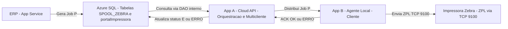
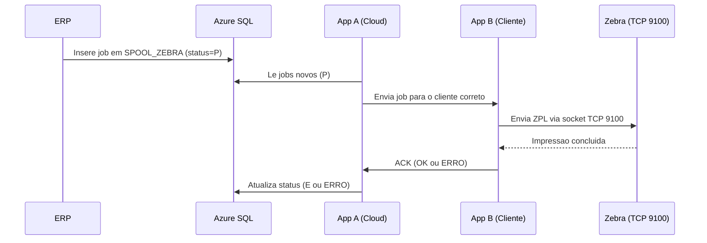

# Documentação Impressora Zebra SPW

Esta documentação detalha a arquitetura e o fluxo de impressão Zebra, incluindo diagramas Mermaid.

## Arquitetura Geral

```mermaid
flowchart LR
    ERP["ERP - App Service"]
    DB["Azure SQL - Tabelas SPOOL_ZEBRA e portalImpressora"]
    AppA["App A - Cloud API - Orquestracao e Multicliente"]
    AppB["App B - Agente Local - Cliente"]
    Zebra["Impressora Zebra - ZPL via TCP 9100"]

    ERP -->|Gera Job P| DB
    DB -->|Consulta via DAO interno| AppA
    AppA -->|Distribui Job P| AppB
    AppB -->|Envia ZPL TCP 9100| Zebra
    AppB -->|ACK OK ou ERRO| AppA
    AppA -->|Atualiza status E ou ERRO| DB
```

## Fluxo Completo de Impressão

```mermaid
sequenceDiagram
    participant ERP as ERP
    participant DB as Azure SQL
    participant AppA as App A (Cloud)
    participant AppB as App B (Cliente)
    participant Printer as Zebra (TCP 9100)

    ERP->>DB: Insere job em SPOOL_ZEBRA (status=P)
    AppA->>DB: Le jobs novos (P)
    AppA->>AppB: Envia job para o cliente correto
    AppB->>Printer: Envia ZPL via socket TCP 9100
    Printer-->>AppB: Impressao concluida
    AppB->>AppA: ACK (OK ou ERRO)
    AppA->>DB: Atualiza status (E ou ERRO)
```
